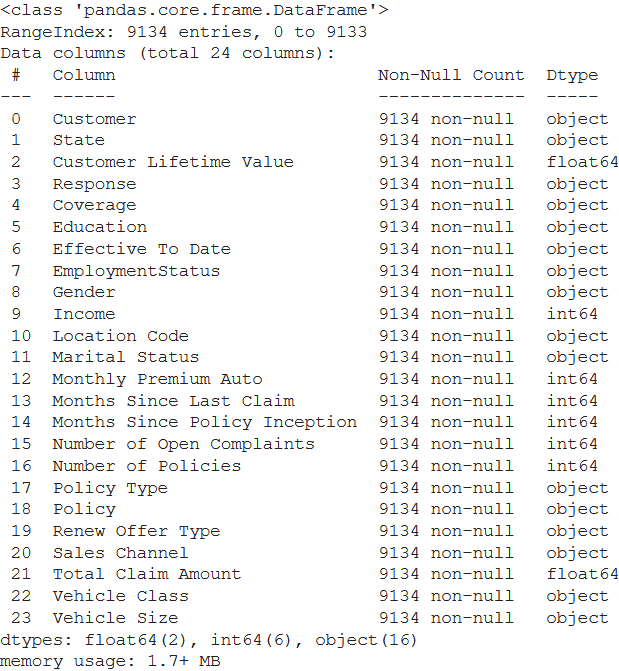
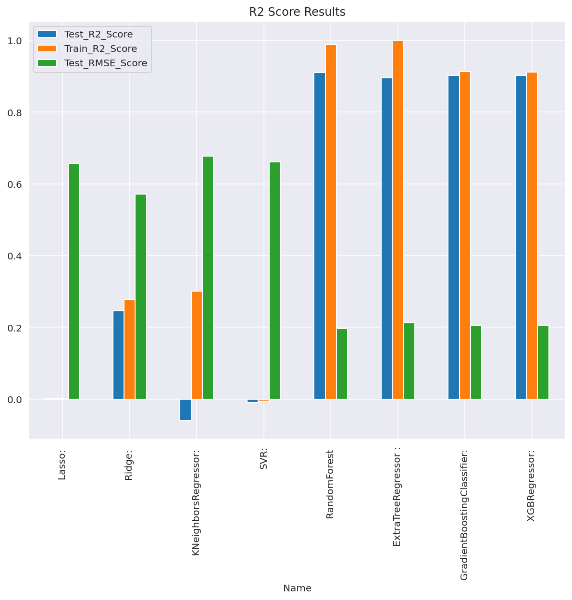

# Predicting-Customer-Lifetime-Value
Customer Lifetime Value, RandomForestRegressor, Parameter tuning, Feature reduction, data visualization, QQ Plot, Normal Distribution and log transform

## Data

The data contains ~10k customers .



## Correlation Check


## Log-Normal Distribution & QQ-Plot


## ML Models Performance table


## Model Performance Visualization Chart



## Results / Conclusion

```
1. The best Algorithm to use for this dataset is RandomForestRegressor
2. Untuned model was able to explain 90.65% of variance on test set 
3. Tuned model was able to explain 91.08% of varaince on test set which is increased by ~0.5
4. Feature reduction was not able to add to better R2 score
```

